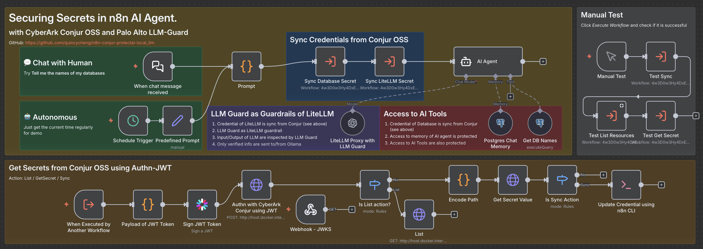
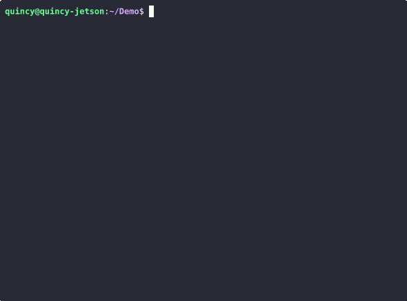
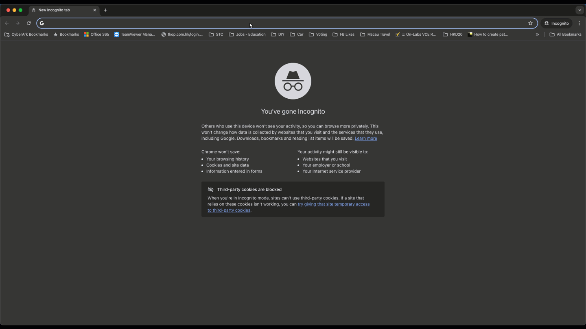
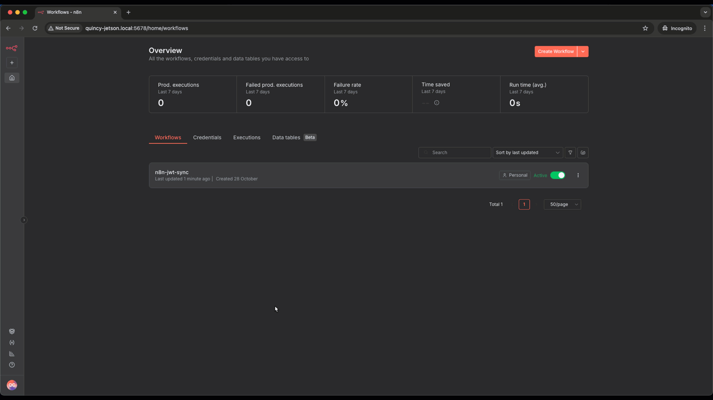
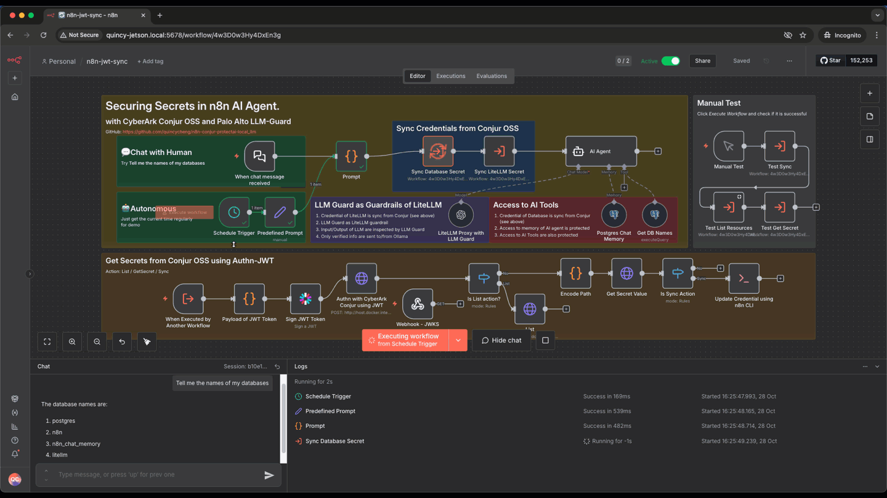

# secure-aiagent-secrets
Securing secrets of AI Agent & LLM with CyberArk Conjur & LLM Guard from ProtectAI | Palo Alto Networks

- ✅ Supports Air-gapped, self-hosted and cloud environment
- ✅ Support autonomous (time-driven and event-driven) and interactive use cases
- ⚙️ Planned to add CyberArk Agent Guard use case

# Use Cases
- ✅ Inject Secrets for AI Tools from Conjur
- ✅ Inject Secrets for AI Agent Memory from Conjur
- ✅ Detect and guardrail secrets from sending LLM as training data
- ✅ Detect and guardrail secrets from sending from LLM as sensitive data
- ⚙️ Secure secrets retrieval for MCP communication

# How to
## Setup
1. Execute `bin/start.sh` to pull and create containers

2. Access n8n web ui at http://<FQDN>:5678, e.g. http://quincy-jetson.local:5678
3. Answer the n8n popup to create an user account for first time access

## Try it out
1. Open the imported workflow named *n8n-jwt-sync* 
2. Test for interactive use case by clicking `Open Chat` and input `Tell me the names of my databases` in the chat windows

3. Test for autonomous use case by clicking `Execute Workflow`

## Software Access
| Software            | Port  | Host/Container                         | Authn Info                                              | Descriptnion                                                                                                                                                                                                                                                                                                                         |
|---------------------|-------|----------------------------------------|---------------------------------------------------------|--------------------------------------------------------------------------------------------------------------------------------------------------------------------------------------------------------------------------------------------------------------------------------------------------------------------------------------|
| Docker/podman       | n/a   | Host                                   | n/a                                                     | https://www.docker.com/                                                                                                                                                                                                                                                                                                              |
| Ollama              | 11434 | Host                                   | n/a                                                     | https://github.com/ollama/ollama Get up and running with large language models.                                                                                                                                                                                                                                                   |
| n8n                 | 5678  | Container                              | User created during first access                        | https://github.com/n8n-io/n8n n8n is a workflow automation platform that gives technical teams the flexibility of code with the speed of no-code. With 400+ integrations, native AI capabilities, and a fair-code license, n8n lets you build powerful automations while maintaining full control over your data and deployments. |
| CyberArk Conjur OSS | 8080  | Container                              | Generated during installation: `data/conjur/admin_data` | https://www.conjur.org/ A seamless open source interface to securely authenticate, control and audit non-human access across tools, applications, containers and cloud environments via robust secrets management.                                                                                                                |
| LLM Guard           | n/a   | Used by llm-guard-litellm microservice | n/a                                                     | https://github.com/protectai/llm-guard LLM Guard by Protect AI is a comprehensive tool designed to fortify the security of Large Language Models (LLMs).                                                                                                                                                                          |
| LiteLLM             | 4000  | Container                              | Generated during installation: `data/.env.litellm`      | https://www.litellm.ai/ LLM Gateway to provide model access, fallbacks and spend tracking across 100+ LLMs. All in the OpenAI format.                                                                                                                                                                                             |
| llm-guard-litellm   | 4321  | Container                              | Generated during installation: `data/.env.llm-guard`    | llm-guard-litellm https://github.com/quincycheng/llm-guard-litellm LLM-Guard container as LiteLLM custom guardrails                                                                                                                                                                                                            |
| PostgreSQL          | 5432  | Container                              | Generated during installation: `data/.env.postgres`     | https://www.postgresql.org/                                                                                                                                                                                                                                                                                                          |
## Destroy it!
- Execute `bin/99-destroy.sh`
